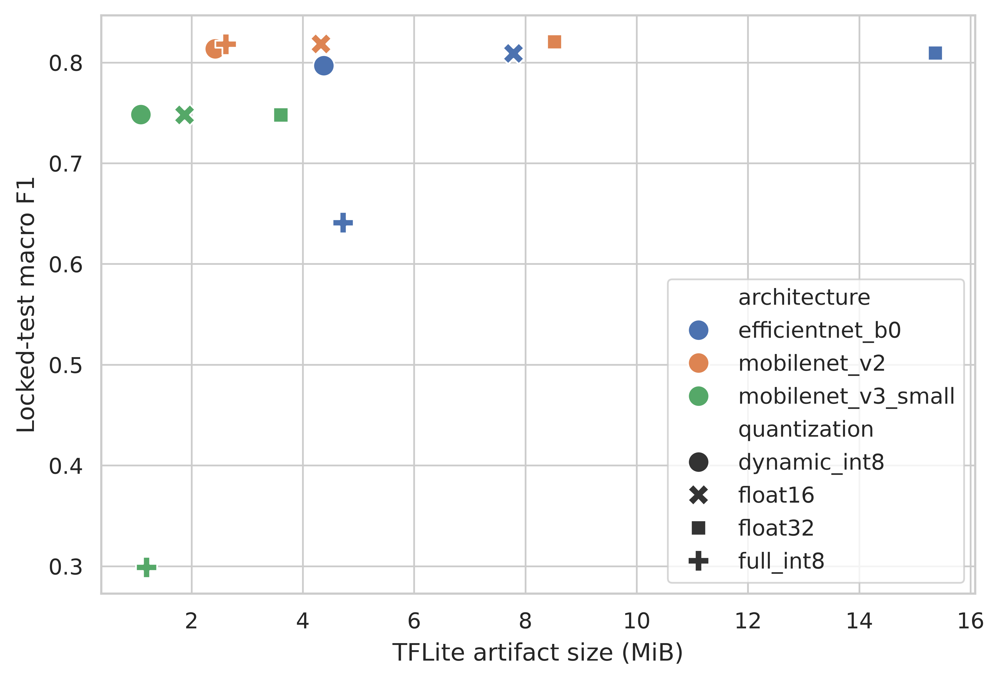
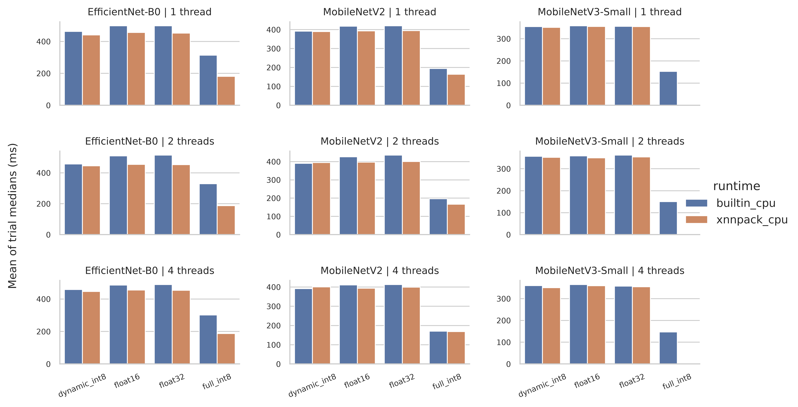
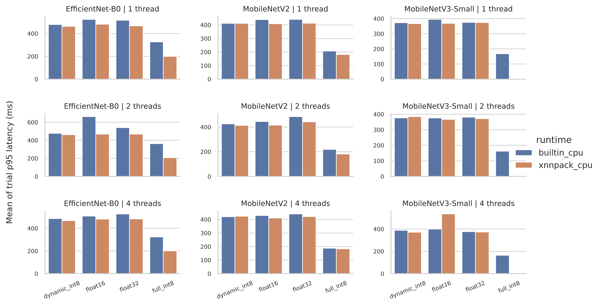
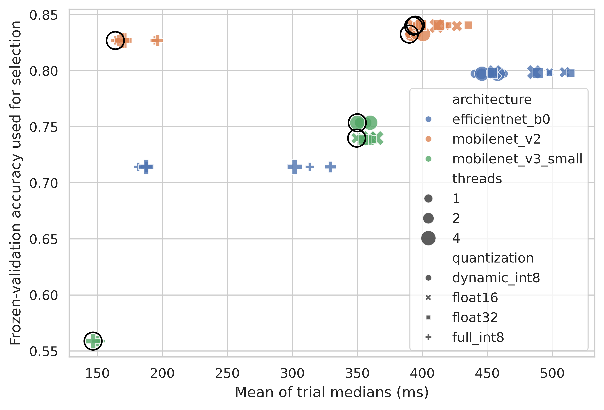
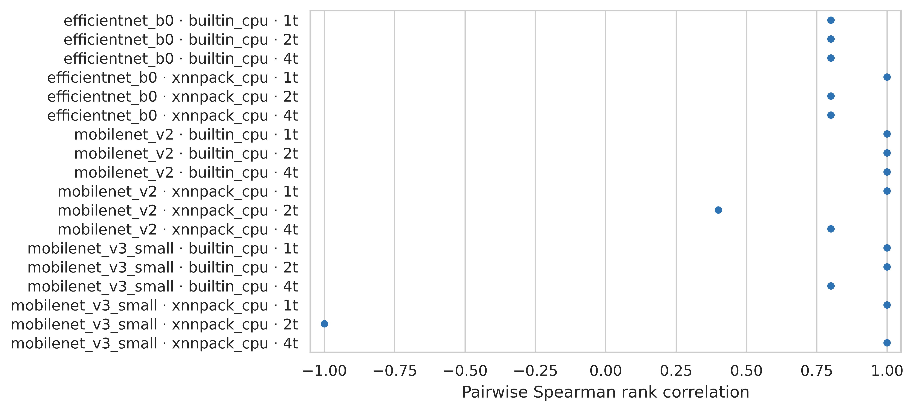

# Abstract

Post-training quantization reduces neural-network storage, but its effect on
realized mobile latency depends on model operators, runtime kernels, delegate
behavior, and threading. This study evaluates MobileNetV2, MobileNetV3-Small,
and EfficientNet-B0 in FP32, FP16, dynamic-range INT8, and full INT8 form on a
lower-cost Android 15 phone. We use a leakage-audited, capture-session-grouped
DeepWeeds split; GPU-controlled transfer learning; training-only calibration;
locked-test classification metrics; and a release-mode LiteRT experiment that
planned three randomized complete trials, 20 warm-ups, and 100 timed invocations
per successful configuration. The run became incomplete during trial 3; trial 3
was excluded wholesale, and the post hoc bounded analysis retains the two
complete balanced trials only. The Android evidence is therefore exploratory
rather than confirmatory. Unlike average-only comparisons, the protocol
retains immutable per-inference observations, configuration errors, process
memory snapshots, battery and thermal context, requested and observed runtime
state, median and tail latency, trial-level uncertainty, and quantization rank
stability. Locked-test accuracy ranged from 53.93% to 84.43% and artifacts from 1.09 to 15.37 MiB; the fastest mean trial median and p95 were 146.77 ms (mobilenet_v3_small_full_int8__builtin_cpu__4t) and 162.34 ms (mobilenet_v3_small_full_int8__builtin_cpu__2t), respectively. Trial-pair rank correlations had minimum -1.000 and median 0.900; 3 configurations produced 6 preserved error rows. Median- and p95-based Pareto fronts contained 7 and 6 configurations, with 3 shared. The findings demonstrate that compression did not guarantee lower latency and that runtime and tail criteria changed configuration ranking on the tested realme RMX3760; they do not
support generalization to other devices. All configuration choices were frozen
before a single test-set evaluation, and hashes link models, raw observations,
predictions, tables, and figures.

**Keywords:** Android; LiteRT; TensorFlow Lite; post-training quantization;
mobile inference; tail latency; repeatability; Pareto analysis

# 1. Introduction

Mobile deployment decisions are frequently summarized as a choice between an
accurate floating-point model and a smaller integer model. That abstraction is
useful for storage but incomplete for execution. Integer-only inference can
produce favorable accuracy-latency trade-offs on compatible ARM kernels
[@P01], while hardware-aware quantization methods show that precision should be
selected in relation to an execution target [@P05; @P06; @P09]. Yet a nominal
precision label does not identify graph partitioning, float conversions,
unsupported operators, runtime kernels, thread scheduling, or fallback. These
details can determine whether a smaller artifact is faster in practice.

The architecture literature reaches a similar conclusion from a different
direction. MobileNetV2 and MobileNetV3 introduced blocks designed around mobile
constraints [@P02; @P07], whereas later work explicitly reported that FLOPs and
parameter count need not predict phone latency [@P18]. FastViT attributes part
of the discrepancy to memory access and structural choices [@P19], and
PikeLPN shows that overlooked non-quantized operations can dominate
low-precision networks [@P29]. MobileNetV4 consequently evaluates universal
mobile blocks across heterogeneous accelerators rather than treating one proxy
as universal [@P25].

Production-oriented benchmarks reveal the same stack dependence at system
scale. AI Benchmark measures complete Android smartphones [@P04; @P08], MLPerf
Mobile specifies controlled and transparent on-device scenarios [@P11], and
nn-Meter builds device-specific latency predictors from fused execution kernels
[@P10]. These works provide strong precedent for real-device measurement. They
do not, however, make every practitioner-facing comparison auditable at the
level of raw repeated observations, tail behavior, conversion and delegate
errors, thermal context, and configuration-rank stability.

Recent Android work narrows the available novelty further. Gherasim and García
Sánchez compare multiple model families, quantization formats, CPU modes, GPU
and NPU execution, accuracy, average latency, and Pareto fronts on a Snapdragon
8 Gen 2 tablet [@P33]. Accordingly, the present study does **not** claim novelty
for Android quantization comparison, accelerator comparison, hardware-aware
selection, or Pareto optimization. Its narrower contribution is an auditable
distributional protocol for ordinary deployable LiteRT variants on a
lower-cost consumer phone:

1. leakage-audited model development with a test split that remains unopened
   until every conversion and device configuration decision is frozen;
2. immutable per-inference latency observations from randomized complete
   trials, including p95/p99 behavior and trial-level uncertainty;
3. explicit retention of conversion and configuration failures rather than
   silent substitution or imputation; and
4. sensitivity of configuration selection to median versus p95 latency,
   artifact size, classification quality, and rank stability.

The study addresses six questions: how standard post-training variants change
classification performance and size (RQ1); how precision, runtime, and threads
interact in median and tail latency (RQ2); whether rankings persist across
complete trials and recorded thermal contexts (RQ3); whether size and latency
ranks agree (RQ4); which configurations are Pareto-efficient under median and
p95 criteria (RQ5); and which conversion or runtime failures prevent nominally
desirable configurations from operating (RQ6).

# 2. Related work

## 2.1 Quantization and hardware-aware optimization

Integer-only inference by Jacob et al. established a practical eight-bit
deployment path for convolutional networks [@P01]. HAQ uses hardware feedback
to allocate mixed precision [@P05], HAWQ uses Hessian sensitivity [@P06], and
HAWQ-V3 combines hardware constraints with dyadic integer execution to avoid
hidden floating-point operations [@P09]. QBitOpt reallocates bit widths during
training [@P22], A2Q constrains accumulator overflow [@P23], and differentiable
mixed-precision optimization exposes accuracy-memory Pareto choices [@P28].
QuantNAS jointly searches architectures and quantization using measured mobile
CPU latency [@P27]. These are richer optimization methods than the four
standard post-training exports studied here; they establish the field and
bound our claim to measurement methodology.

Post-training work also demonstrates that conversion quality is
architecture-dependent. QDrop reduces train-test mismatch during low-bit PTQ
[@P13], PTQ4ViT addresses activation distributions in vision transformers
[@P14], and FQ-ViT and I-ViT implement quantized nonlinear paths
[@P15; @P21]. Performance characterization across OpenVINO, TensorFlow Lite,
ONNX, and PyTorch shows that precision effects depend on the runtime and edge
platform [@P17]. The present work therefore measures both classification
parity and mobile execution; a successful converter call alone is not treated
as evidence of a useful deployment.

## 2.2 Mobile architectures and latency proxies

MobileNetV2's inverted residuals and linear bottlenecks [@P02] and
MobileNetV3's platform-aware search and nonlinearities [@P07] are widely
deployable baselines. EfficientNet supplies a contrasting compound-scaled CNN
[@P34]. Other relevant mobile backbones include MobileViT [@P12], MobileOne
[@P18], FastViT [@P19], EfficientViT [@P20], RepViT [@P26], and XiNet
[@P24]. MobileNVC demonstrates an end-to-end neural video system on a phone
[@P30], while memory-efficient CNN design emphasizes peak memory as a separate
deployment constraint [@P31]. Together, these studies caution against using
parameters or operations as a universal performance surrogate.

## 2.3 Benchmarks and reproducible on-device evidence

AMC targets model compression for mobile deployment [@P03], and mobile neural
architecture search has extended hardware-aware optimization to
super-resolution [@P16]. AI Benchmark and MLPerf Mobile provide broad
smartphone comparisons and reporting rules [@P04; @P08; @P11], whereas
nn-Meter predicts latency for particular edge-device/runtime combinations
[@P10]. MobileAIBench extends configuration-level evaluation to on-device
language and multimodal models [@P32]. The gap addressed here is smaller:
repeatable distributional evidence for standard LiteRT image-classifier
exports, including raw tail latency, complete-trial ranking, and errors on an
economical Android device.

# 3. Materials and methods

## 3.1 Integrity controls and decision sequence

The protocol separated model development, device configuration, and final
evaluation. Dataset and capture-session manifests were frozen before training.
Architecture, quantization, calibration, parity, Android runtime, thread count,
warm-up, trial, randomization, and analysis rules were fixed using training,
validation, and pilot evidence. The 3,501-image test manifest was not read by
any metric evaluator until the final manifest status was changed to
`FROZEN_FOR_FINAL_TEST`. The final evaluator is fail-closed: it refuses any
other status, performs the complete Keras and TFLite evaluation in one session,
and hashes both the test manifest and per-sample prediction file.

We distinguish prior project evidence from new-study results. The earlier
plant-disease project motivated quantization and size/latency comparisons, but
its measurements are not pooled with this experiment. Only reusable procedural
lessons, schema design, and failure checks were carried forward.

## 3.2 Dataset, leakage audit, and splits

DeepWeeds contains 17,509 field images across eight weed classes and a negative
class. We used the official archive under CC BY 4.0 (SHA-256
`0961f63c01b997bfab1559ad09e99c0e8130617fd96a8b92fdc09940e01b0ce8`).
Images were grouped into capture sessions defined by the same acquisition
instrument and consecutive timestamps separated by at most 90 s. A seeded,
deterministic greedy allocation preserved complete groups while approximating
class balance, producing 1,105 groups and 10,506/3,502/3,501 images for
training/validation/test. The largest group contained 224 images.

The validation audit checked manifest completeness, decodability, filename
overlap, exact SHA-256 duplicates, perceptual near-duplicate candidates, and
capture-group separation. It found zero missing or unreadable images, zero
filename or exact-hash cross-split overlaps, and one perceptual candidate that
manual review classified as distinct. No capture group crossed a split. The
manifest hashes are `a4dde73f...596ab5` (training),
`a7f73270...76e2b` (validation), and `567b554a...dae86` (test); full hashes are
retained in the machine-readable metadata.

## 3.3 Model training

The model set comprises ImageNet-initialized MobileNetV2, MobileNetV3-Small,
and EfficientNet-B0 with 224 × 224 RGB input and a nine-class softmax head.
Input preprocessing is embedded in each exported Keras graph. Training used
TensorFlow 2.21 under WSL2, balanced training-only class weights, Adam, batch
size 8, and seed 42. The backbone was frozen for five epochs at learning rate
10^-3 and then fine-tuned for at most 25 additional epochs at 10^-5. Early
stopping monitored validation loss with patience five and restored the best
checkpoint. Augmentation comprised a deterministic stateless crop, horizontal
flip, brightness change, and contrast change.

Heavy tensor computation was fail-closed to an NVIDIA GeForce GTX 1650. Each
launcher required a physical TensorFlow GPU, enabled memory growth, executed a
smoke tensor on `/GPU:0`, and recorded the NVIDIA driver and TensorFlow
environment. A batch-size-16 feasibility attempt exhausted GPU memory for
EfficientNet-B0; batch size 8 was then tested for all models and frozen rather
than adjusted per architecture.

## 3.4 Post-training conversion and validation gating

Each restored Keras model was converted to four LiteRT/TFLite artifacts: FP32,
FP16 weight quantization, dynamic-range INT8, and full INT8. Full INT8 used a
canonical 800-sample representative set drawn only from the training split;
the ordered calibration tensor and its hash were reused for all architectures.
Full INT8 required integer input and output tensors and the built-in INT8
operator set. Conversion reports retain failures, file size, SHA-256, and tensor
metadata.

Every flatbuffer had to allocate and execute with the built-in interpreter.
Validation parity then compared accuracy and top-1 agreement against the Keras
reference over all 3,502 validation images. Variants with large degradation
were retained as negative evidence and marked unsuitable for selection rather
than silently removed. No test outcome influenced conversion, calibration, or
the app manifest.

## 3.5 Android device and inference application

The deployment target was a realme RMX3760 running Android 15/API 35, with a
Spreadtrum UMS9230H SoC, eight online CPU cores, approximately 5.63 GiB RAM,
and an ARM Mali-G57 GPU. Values were read from Android system properties, ADB,
and the app; unavailable GPU core count and NPU identity were not inferred.

The release-mode Flutter application bundles the exact hashed flatbuffers and
serves two purposes. Its inference screen selects a bundled configuration,
loads an image from camera or gallery, center-crops and resizes to 224 × 224,
executes locally, and reports predicted class, confidence, timed inference, and
artifact size with a research-only warning. Its experiment screen runs the frozen randomized benchmark in a background Dart isolate, with frozen flatbuffers transferred from the root isolate, and writes an immutable CSV to app-specific external storage. This keeps the UI responsive without changing the interpreter-only timed region.

Android 15 deprecates NNAPI, the phone did not expose a listable neural-networks
service, and effective NNAPI execution could not be verified; NNAPI was
therefore excluded rather than labelled as accelerated. The tested runtimes
were the built-in CPU path and an explicitly constructed XNNPACK CPU delegate.
An XNNPACK custom-options constructor caused a reproducible native crash during
pilot testing; the stable null-options constructor was frozen. Requested
delegate, observed initialization state, delegate errors, and configuration
failures were recorded. A configuration that failed was not replaced with a
fallback latency.

## 3.6 Frozen benchmark protocol

The factorial matrix comprised 3 architectures × 4 quantization variants × 2
runtimes × 3 thread counts (1, 2, and 4), subject to preserved configuration
failures. Each successful configuration used a deterministic preallocated input
tensor, 20 untimed warm-ups, and 100 interpreter-only timed invocations in each
of three planned complete trials. The run became incomplete during trial 3, so
trial 3 was excluded wholesale and the post hoc bounded analysis retained the
two complete balanced trials only. Accordingly, the Android evidence is
exploratory rather than confirmatory. Configuration order was reshuffled within
every trial using seed 42. The screen remained on; USB charging state, battery saver,
thermal status, battery temperature, process proportional set size (PSS), and
resident set size (RSS) were recorded. Background applications were not
injected, but their absence could not be fully verified.

The benchmark stores one row per timed invocation plus one explicit row for
each configuration error. Rows contain model and protocol hashes, architecture,
precision, requested and observed delegate state, thread count, trial and
randomization index, model-load time, latency, memory, power/thermal context,
and error text. Timed values exclude decoding, preprocessing, interpreter
construction, and UI work.

## 3.7 Outcomes and statistical analysis

Classification outcomes are accuracy, macro precision, macro recall, macro F1,
per-class metrics, confusion matrices, and TFLite-to-Keras top-1 agreement.
Systems outcomes are artifact size, median, p90, p95 and p99 latency, latency
coefficient of variation, model-load time, process PSS/RSS, configuration error
count, and recorded thermal context.

The complete randomized trial - not each invocation - is the experimental unit for
uncertainty. Per-inference rows determine distributional quantiles. For every
successful configuration we report the mean and standard deviation of the two
complete-trial medians and trial p95 values, plus a deterministic nonparametric
95% bootstrap interval obtained by resampling the two complete-trial summaries
(20,000 resamples). Because only two trials and one physical device
are available, these intervals describe run repeatability and must not be
interpreted as population-level device confidence intervals.

Within each architecture/runtime/thread context, quantization ranks from each
pair of complete trials are compared with Spearman correlation. Pareto fronts
maximize frozen-validation accuracy and minimize artifact bytes together with either
mean trial-median latency or mean trial-p95 latency. A configuration is
dominated only when another is no worse on every objective and strictly better
on at least one. The test set supplies final reporting quality, but all model
and configuration candidates entering this analysis were frozen beforehand.

# 4. Results

## 4.1 Training, conversion, and locked-test classification

All 12 frozen flatbuffers completed the locked 3,501-image evaluation. Test accuracy ranged from 53.93% (mobilenet_v3_small full_int8) to 84.43% (mobilenet_v2 float32); the highest macro F1 was 82.05% for mobilenet_v2 float32. Artifact size ranged from 1.09 to 15.37 MiB. The low MobileNetV3-Small full-INT8 validation parity was retained before test opening and remained visible in the locked-test table rather than being removed post hoc.

**Table 1. Classification quality, size, validation gating, and artifact identity for every frozen TFLite variant.**

| Architecture | Variant | Bytes | MiB | Compression vs FP32 | Val. acc. | Val. agreement | Test acc. | Macro P | Macro R | Macro F1 | SHA-256 prefix |
| --- | --- | --- | --- | --- | --- | --- | --- | --- | --- | --- | --- |
| efficientnet_b0 | dynamic_int8 | 4,592,176 | 4.38 | 71.5% | 79.73% | 95.69% | 81.49% | 76.89% | 84.64% | 79.68% | 9d69d6ea033b |
| efficientnet_b0 | float16 | 8,165,448 | 7.79 | 49.3% | 79.87% | 99.74% | 82.52% | 77.72% | 85.78% | 80.89% | 8b487a255909 |
| efficientnet_b0 | float32 | 16,115,064 | 15.37 | 0.0% | 79.78% | 100.00% | 82.55% | 77.74% | 85.83% | 80.93% | 4e7bf575be33 |
| efficientnet_b0 | full_int8 | 4,953,200 | 4.72 | 69.3% | 71.42% | 74.41% | 70.87% | 69.25% | 65.19% | 64.10% | bf768dda79fe |
| mobilenet_v2 | dynamic_int8 | 2,545,400 | 2.43 | 71.5% | 83.27% | 96.63% | 83.89% | 81.35% | 82.76% | 81.35% | 97e33bb8b77f |
| mobilenet_v2 | float16 | 4,537,556 | 4.33 | 49.2% | 83.98% | 99.51% | 84.29% | 81.26% | 83.65% | 81.84% | 801130c48bc4 |
| mobilenet_v2 | float32 | 8,937,820 | 8.52 | 0.0% | 84.07% | 100.00% | 84.43% | 81.48% | 83.82% | 82.05% | bec15e3963d4 |
| mobilenet_v2 | full_int8 | 2,748,320 | 2.62 | 69.3% | 82.70% | 93.35% | 84.06% | 81.59% | 83.43% | 81.80% | 0b1cdd47d0b7 |
| mobilenet_v3_small | dynamic_int8 | 1,144,288 | 1.09 | 69.7% | 75.36% | 87.38% | 77.63% | 71.27% | 79.82% | 74.82% | 1c3ca9e08ab1 |
| mobilenet_v3_small | float16 | 1,967,356 | 1.88 | 48.0% | 73.99% | 99.51% | 76.32% | 69.47% | 83.19% | 74.79% | 201167c633c4 |
| mobilenet_v3_small | float32 | 3,782,516 | 3.61 | 0.0% | 73.84% | 100.00% | 76.35% | 69.49% | 83.14% | 74.79% | cf6183dcd31c |
| mobilenet_v3_small | full_int8 | 1,252,008 | 1.19 | 66.9% | 55.88% | 50.63% | 53.93% | 48.56% | 30.44% | 29.88% | 7eb4e5feb3ad |

Keras references and complete per-class metrics/confusion matrices remain in the hash-linked final-test JSON; Table 1 reports the deployable flatbuffers used on the phone.

## 4.2 Android latency, memory, and operational failures

The device run contained 13,800 timed observations from 69 successful configurations and 6 explicit error rows representing 3 failed configurations. The fastest mean trial-median latency was 146.77 ms for mobilenet_v3_small_full_int8__builtin_cpu__4t; the fastest mean trial-p95 latency was 162.34 ms for mobilenet_v3_small_full_int8__builtin_cpu__2t. Across successful configurations, median process PSS snapshots ranged from 397.89 to 673.59 MiB and RSS snapshots ranged from 423.51 to 628.88 MiB.

The preserved failed configurations were: mobilenet_v3_small_full_int8/xnnpack_cpu/1t (2/3 trials: Bad state: failed precondition); mobilenet_v3_small_full_int8/xnnpack_cpu/2t (2/3 trials: Bad state: failed precondition); mobilenet_v3_small_full_int8/xnnpack_cpu/4t (2/3 trials: Bad state: failed precondition). Battery temperature ranged from 41.0 to 46.1 °C, with charging states charging, full. Because USB power remained connected and the preferred ≤35 °C start condition was not met, these observations are not described as a cold or thermally controlled run.

**Table 2. Runtime/thread summary across successful model-quantization configurations. Brackets give the observed configuration range; the complete 72-configuration ledger is Supplementary Table 5.**

| Runtime | Threads | Successful | Failed | Median of trial medians [range] ms | Median of trial p95 [range] ms | Median PSS MiB | Median RSS MiB |
| --- | --- | --- | --- | --- | --- | --- | --- |
| builtin_cpu | 1 | 12 | 0 | 375.24 [152.78, 497.94] | 403.53 [167.47, 523.93] | 562.36 | 495.66 |
| builtin_cpu | 2 | 12 | 0 | 376.26 [150.28, 514.27] | 403.66 [162.34, 661.78] | 584.57 | 557.98 |
| builtin_cpu | 4 | 12 | 0 | 378.46 [146.77, 489.14] | 410.57 [164.59, 526.66] | 581.96 | 521.71 |
| xnnpack_cpu | 1 | 11 | 1 | 390.04 [163.91, 456.39] | 409.20 [182.27, 481.95] | 565.30 | 539.58 |
| xnnpack_cpu | 2 | 11 | 1 | 395.03 [166.44, 454.25] | 414.15 [181.49, 468.91] | 475.22 | 506.51 |
| xnnpack_cpu | 4 | 11 | 1 | 393.49 [168.81, 455.59] | 421.70 [183.67, 535.39] | 553.60 | 501.69 |

The complete 72-configuration ledger, trial-level intervals, throughput, and error rows are provided in the hash-linked supplement. Figures 2 and 3 show the successful configurations for median and p95 latency without replacing unsupported configurations with fallback values.

## 4.3 Rank stability and Pareto sensitivity

Artifact-size and latency orders differed in 18 of 18 architecture/runtime/thread contexts. Quantization order changed between built-in and XNNPACK paths in 7 of 9 comparable architecture/thread contexts. Pairwise complete-trial Spearman correlations ranged from -1.000 to 1.000, with median 0.900.

The validation-quality/size/latency Pareto analysis identified 7 median-based and 6 p95-based configurations, with 3 shared. Median-only configurations were mobilenet_v2_full_int8__xnnpack_cpu__1t, mobilenet_v3_small_dynamic_int8__xnnpack_cpu__4t, mobilenet_v3_small_float16__xnnpack_cpu__2t, mobilenet_v3_small_full_int8__builtin_cpu__4t; p95-only configurations were mobilenet_v2_full_int8__xnnpack_cpu__2t, mobilenet_v3_small_dynamic_int8__xnnpack_cpu__1t, mobilenet_v3_small_full_int8__builtin_cpu__2t. Thus the selected frontier changed when tail latency replaced median latency. Figures 4 and 5 visualize the validation-only Pareto surface and complete-trial rank stability; locked-test metrics are reporting outcomes and were not selection inputs.

# 5. Discussion

The results separate artifact compression from realized execution. H1 was supported descriptively: size order and median-latency order disagreed in 18/18 contexts. H2 was supported descriptively: runtime changed the quantization ordering in 7/9 comparisons. These reversals are consistent with operator coverage, data conversion, memory access, and runtime-kernel differences, but the logs do not identify a single causal mechanism.

H3 was supported descriptively: 29 INT8 configuration rows were outside the median-based Pareto front, so an unconditional “always INT8” rule would retain choices dominated under the frozen validation/size/device evidence. The poor MobileNetV3-Small full-INT8 parity and its XNNPACK configuration failures show why integer-only conversion success is not equivalent to an accurate, executable deployment [@P01; @P09; @P29]. This agrees with the broader Android finding that quantization outcomes depend on model and execution path [@P33].

For H4, the median trial-level CV was builtin_cpu=0.0052, xnnpack_cpu=0.0078, a max/min ratio of 1.51. These descriptive differences and the median-versus-p95 frontier change are consistent with H4, but 2 complete trials on one device are insufficient for a population-level significance claim. Tail summaries therefore add decision information without converting repeated invocations into pseudo-replicates.

Protocol 1.1 produced an incomplete ANR-terminated run when synchronous LiteRT calls occupied Flutter's UI isolate. That raw file was hashed, preserved, and categorically excluded. Protocol 1.2 transferred the frozen flatbuffers to a background Dart isolate and restarted all trials from the beginning. This correction is part of the failure provenance, not a pooled pilot observation.

# 6. Threats to validity and limitations

Only one physical Android phone was tested, so the study cannot estimate
between-device variability or claim transfer to other SoCs, Android releases,
LiteRT builds, or vendor kernels. Two complete balanced trials provide only a
limited description of short-run repeatability and imprecise trial-level
uncertainty; the planned third trial was excluded wholesale after the run became
incomplete, so the Android analysis is exploratory rather than confirmatory.
USB charging was recorded rather
than eliminated, and background load was not fully controllable. Battery
temperature and Android thermal status are contextual observations, not direct
SoC power or energy measurements.

XNNPACK initialization can be observed, but the Flutter binding does not expose
a complete operator-partition audit. Therefore delegate-state conclusions must
remain limited to successfully constructed configurations and preserved errors;
they must not imply every operator ran in a specific kernel. PSS and RSS are
process snapshots that include runtime and application allocations, not an
isolated peak-model-memory instrument. Interpreter-only synthetic-input latency
does not represent camera capture, image preprocessing, UI, or end-to-end
application response.

DeepWeeds is class-imbalanced and geographically/task specific. Capture-session
grouping reduces one leakage mechanism but does not establish ecological
external validity. The local inference screen is a research prototype, not an
agronomic or safety decision system. Standard PTQ variants were intentionally
studied; conclusions do not compare advanced quantization-aware training,
mixed-precision search, pruning, distillation, GPU delegates, or vendor NPUs.

# 7. Conclusion

On the tested realme RMX3760 stack, quantization label and file size alone did not determine deployment performance. The 12 frozen flatbuffers spanned 53.93%-84.43% locked-test accuracy and 1.09-15.37 MiB, while runtime/thread choices changed latency order and median-versus-p95 criteria changed the Pareto frontier. Configuration errors and the MobileNetV3-Small full-INT8 quality loss remained part of the result rather than being hidden by fallback or post-test exclusion.

For this phone and software stack only, a practical shortlist is mobilenet_v2_dynamic_int8__xnnpack_cpu__1t, mobilenet_v2_float16__xnnpack_cpu__1t, mobilenet_v2_float32__xnnpack_cpu__1t; selection among it should use the application's tolerance for median versus tail latency together with the frozen validation quality and artifact-size constraints. No cross-device recommendation follows from one phone, and a new device/runtime combination should rerun the same hashed, complete-trial protocol.

# Declarations

## Funding

This research received no specific grant from any funding agency in the public,
commercial, or not-for-profit sectors.

## Conflict of interest

The author declares no known competing financial interests or personal
relationships that could have appeared to influence the work reported in this
paper.

## Ethics statement

The study uses a publicly released image dataset and performance measurements
from an investigator-controlled phone. It does not involve human participants,
personal data collection, or animal experimentation.

## Data availability

The DeepWeeds source archive is available under CC BY 4.0 from its official
repository. Frozen split manifests, hashes, validation reports, raw benchmark
observations, final per-sample predictions, and derived tables are included in
the accompanying artifact package. Redistribution of source images follows the
dataset license. A Zenodo record has been reserved for the reproducibility
artifact at https://doi.org/10.5281/zenodo.22080295 and will be made public
before manuscript submission.

## Code availability

Training, conversion, parity evaluation, Android benchmarking, locked-test
evaluation, statistical analysis, and figure-generation code are included in
the reproducibility artifact. Environment reports and SHA-256 provenance
records link executed outputs to their source models and data. The reserved
artifact DOI is https://doi.org/10.5281/zenodo.22080295; the Zenodo record will
be made public before manuscript submission.

# References

References are generated from `paper/references.bib`; DOI fields are included
only when verified against primary publication records.
